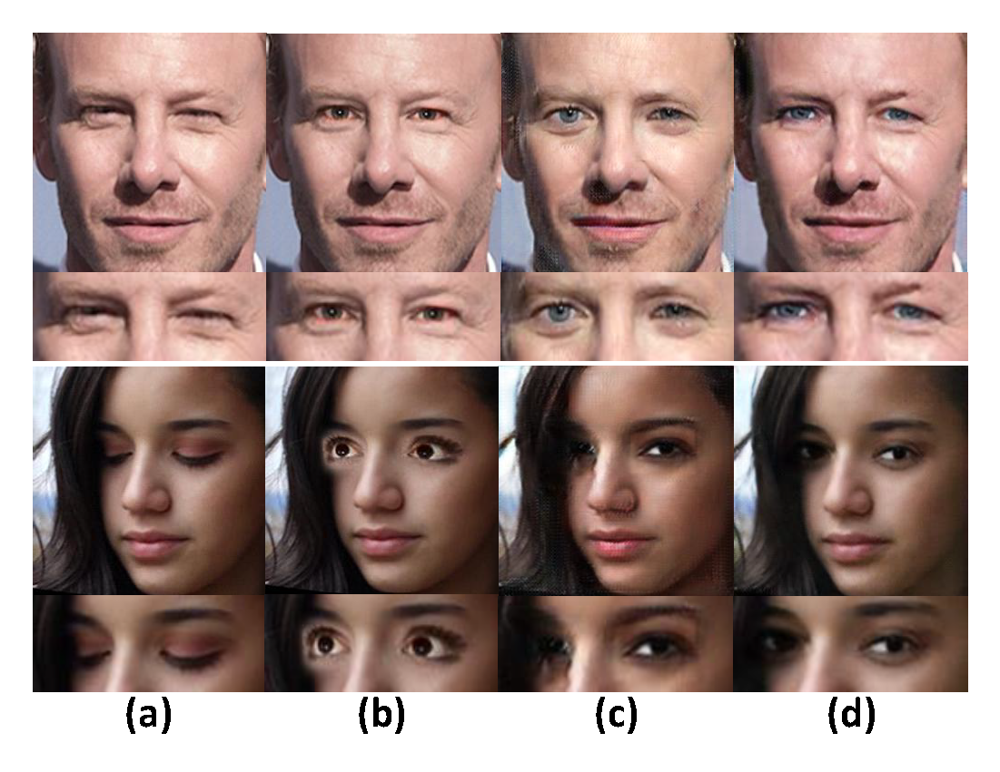
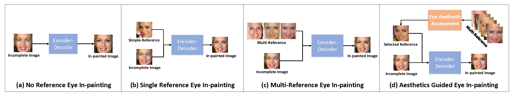
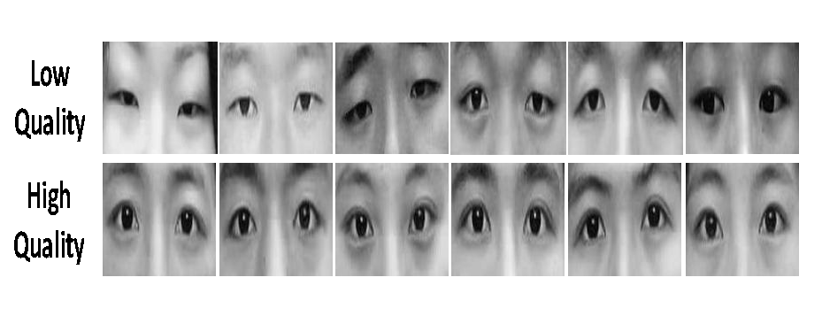
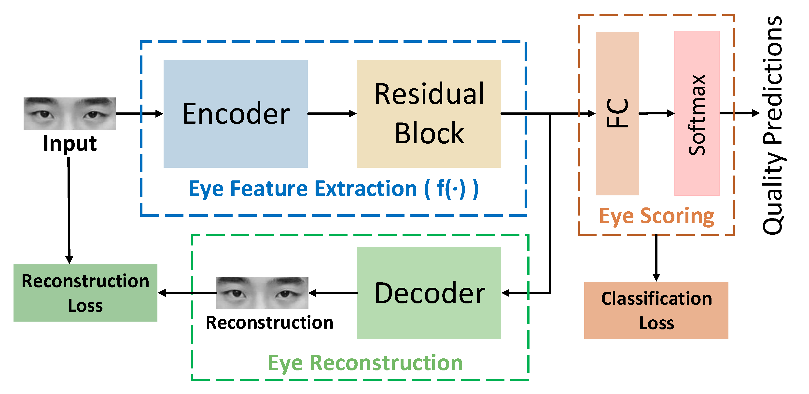
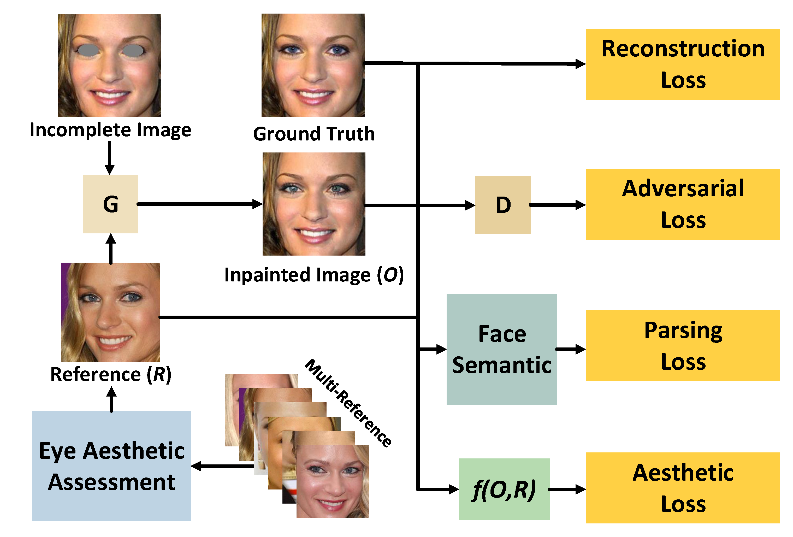

# AesGAN —— Assessing Eye Aesthetics for Automatic Multi-Reference Eye In-Painting

The tensorflow implement of [Assessing Eye Aesthetics for Automatic Multi-Reference Eye In-Painting](https://openaccess.thecvf.com/content_CVPR_2020/papers/Yan_Assessing_Eye_Aesthetics_for_Automatic_Multi-Reference_Eye_In-Painting_CVPR_2020_paper.pdf)

## Abstract
With the wide use of artistic images, aesthetic quality assessment has been widely concerned. How to integrate aesthetics into image editing is still a problem worthy of discussion. In this paper, aesthetic assessment is introduced into eye in-painting task for the first time. We construct an eye aesthetic dataset, and train the eye aesthetic assessment network on this basis. Then we propose a novel eye aesthetic and face semantic guided multi-reference eye inpainting GAN approach (AesGAN), which automatically selects the best reference under the guidance of eye aesthetics. A new aesthetic loss has also been introduced into the network to learn the eye aesthetic features and generate highquality eyes. We prove the effectiveness of eye aesthetic assessment in our experiments, which may inspire more applications of aesthetics assessment. Both qualitative and quantitative experimental results show that the proposed AesGAN can produce more natural and visually attractive eyes compared with state-of-the-art methods.

<div align=center></div>
Eye in-painting results. Columns represent: (a) Image to in-paint, (b) The commercial state-of-the-art eye opening algorithm in Adobe Photoshop Elements 2019, (c) ExGAN result, and (d) Our AesGAN result.


## Motivation
**Comparison of different eye in-painting frameworks.** (a) Traditional eye in-painting methods do not use references, which only use incomplete images as input and finally output repaired images through encoders and decoders. (b) Single reference based eye inpainting methods use one reference image to assist in-painting, while (c) multi-reference based eye in-painting methods take multiple references. (d) Our proposed aesthetic guided eye in-painting method takes aesthetics as the criterion of reference selection, and uses the final selected image as the input.
<div align=center></div>

## Eye Aesthetic Assessment
**Building Aesthetic Dataset**：Based on the CAS-PEAL Dataset, we annotate a new eye dataset with 1,040 eye images. 22 volunteers are invited to make the eye aesthetic assessment. According to the average level of manual tagging, the dataset is divided into two grades: high quality and low quality.
<div align=center></div>

**Aesthetic Assessment Network**：We first introduce the reconstruction branch into the image quality assessment task to maintain the uniqueness of eye aesthetic. Only the eye aesthetic feature extraction module and the eye scoring module are needed during testing.
<div align=center></div>

## Eye In-Painting with Eye Aesthetic Assessment
We introduce the eye aesthetic assessment into the eye in-painting task, and propose the eye aesthetic and face semantic guided multi-reference eye in-painting method (AesGAN). Given an incomplete image, our goal is to produce natural and attractive eyes that are both semantically consistent with the whole object and visually realistic. The proposed network that consists of one generator, two discriminators, an eye aesthetic assessment network and a parsing network.
We use the eye aesthetics assessment network and structural similarity index (SSIM) to automatically select the best reference. In order to highlight the role of eye aesthetic assessment, we introduced a new aesthetic loss. At the same time, a parsing loss is added to ensure the fidelity and semantic consistency of pixels. The parameters of parsing network and eye assessment network are fixed when training.
<div align=center></div>

## Datasets
For the eye in-painting task, we use the Celeb-ID dataset to train and test our model, which contains about 17k personal identities and a total of 100k photos. Each celebrity has at least 3 photos. We split the dataset according to the following criteria: for any celebrity, if there is a closed-eye photo in his samples, all his photos will be classified as the test set, otherwise classified as the training set.

## Training
* Download Celeb-ID dataset and save it to `celeb_id_aligned/`.
* Download the parsing maps and save it to `gt_labels/`.
* Pre-train the eyenet/parsing model and save them to `model_eyescore/` and `model_parsing/`.
* Set **OPER_FLAG** in `main.py` as **0** for training.
* Divide the training set and select references. Then save the details of images as a `json` file to `json/`. Note if there is existing files in `json/` folder, the program calls directly. If this folder does not exist, the program automatically divides the training set and selects the reference according to our selection policy.
* Run `python main.py`

## Testing
* Set **OPER_FLAG** in `main.py` as **1** for testing.
* Run `python main.py`

## <span id="jump1">Citation</span>
```
@InProceedings{Yan_2020_CVPR,
    Author = {Bo Yan and Qing Lin and Weimin Tan and Shili Zhou},
    Title = {Assessing Eye Aesthetics for Automatic Multi-Reference Eye In-Painting},
    booktitle = {Proceedings of the IEEE Conference on Computer Vision and Pattern Recognition},
    month = {June},
    year = {2020}
    
}
```

## Acknowledgments
We benefit a lot from [Exemplar_GAN_Eye_Inpainting](https://github.com/zhangqianhui/Exemplar-GAN-Eye-Inpainting-Tensorflow).
